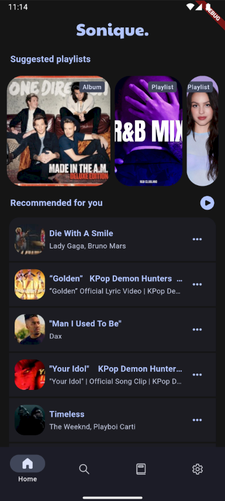
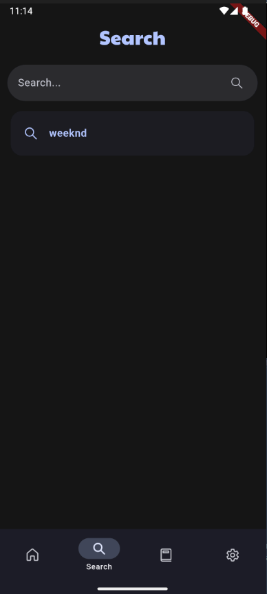
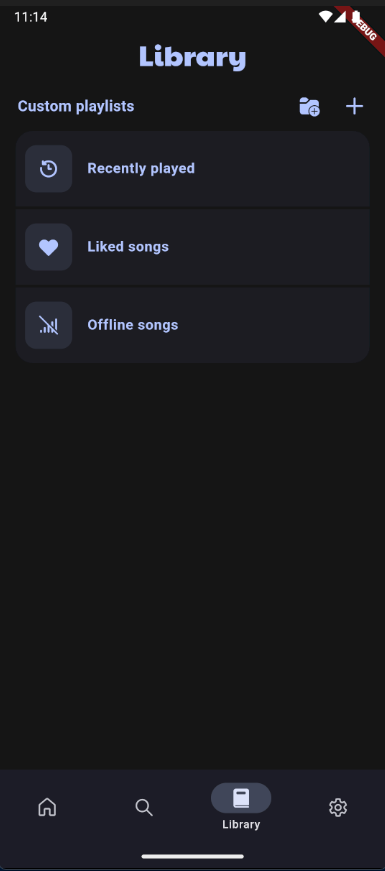

# Sonique


**Unlock the full potential of music: Stream effortlessly with one app!**

[](https://www.gnu.org/licenses/gpl-3.0)
[](https://flutter.dev/)
[](https://github.com/dipansh08/Sonique/releases)

## ✨ Features

- 🎵 **Online Music Search** - Find any song with intelligent suggestions
- 📱 **Offline Listening** - Download and enjoy music without internet
- 📂 **Playlist Management** - Create custom playlists and import from links
- 🎧 **High-Quality Audio** - Optimized sound experience for audiophiles
- 🚫 **Ad-Free Experience** - No interruptions, no subscriptions
- 📝 **Lyrics Support** - Sing along with synchronized lyrics
- 🌍 **Multi-Language** - Available in 20+ languages
- 🎨 **Material Design** - Beautiful UI with accent colors and dynamic theming
- 📊 **Data Management** - Import/export your music library safely
- 🔄 **Auto-Updates** - Built-in updater keeps your app current
- ⏩ **SponsorBlock** - Skip sponsored segments automatically

## 📱 Screenshots

| Home                                                                            | Search                                                                          | Library                                                                         | Playlists                                                                       |
| ------------------------------------------------------------------------------- | ------------------------------------------------------------------------------- | ------------------------------------------------------------------------------- | ------------------------------------------------------------------------------- |
|  |  |  |  |

## 🚀 Getting Started

### Installation

1. **Clone the repository**

   ```bash
   git clone https://github.com/dipansh08/Sonique.git
   cd Sonique
   ```

2. **Install dependencies**

   ```bash
   flutter pub get
   ```

3. **Run the app**
   ```bash
   flutter run
   ```

### Building for Release

#### Android

```bash
flutter build apk --release
# or
flutter build appbundle --release
```

## 🛠️ Configuration

### Custom Themes

Modify theme settings in `lib/config/themes.dart` to customize the app's appearance.


<div align="center">

**⭐ Star this repository if you found it helpful! ⭐**

Made with ❤️ by Dipansh Singh

</div>
