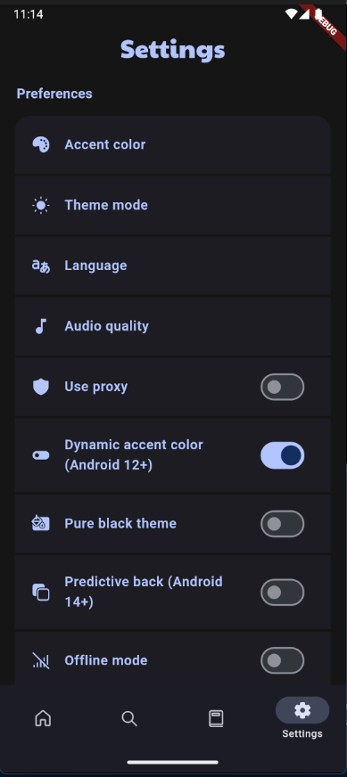

# Sonique


**Unlock the full potential of music: Stream effortlessly with one app!**

[](https://www.gnu.org/licenses/gpl-3.0)
[](https://flutter.dev/)
[](https://github.com/dipansh08/Sonique/releases)

## ✨ Features

- 🎵 **Online Music Search** - Find any song with intelligent suggestions
- 📱 **Offline Listening** - Download and enjoy music without internet
- 📂 **Playlist Management** - Create custom playlists and import from links
- 🎧 **High-Quality Audio** - Optimized sound experience for audiophiles
- 🚫 **Ad-Free Experience** - No interruptions, no subscriptions
- 📝 **Lyrics Support** - Sing along with synchronized lyrics
- 🌍 **Multi-Language** - Available in 20+ languages
- 🎨 **Material Design** - Beautiful UI with accent colors and dynamic theming
- 📊 **Data Management** - Import/export your music library safely
- 🔄 **Auto-Updates** - Built-in updater keeps your app current
- ⏩ **SponsorBlock** - Skip sponsored segments automatically

## 📱 Screenshots

| Home                                                                            | Search                                                                          | Library                                                                         | Playlists                                                                       |
| ------------------------------------------------------------------------------- | ------------------------------------------------------------------------------- | ------------------------------------------------------------------------------- | ------------------------------------------------------------------------------- |
|  |  |  |  |

## 🚀 Getting Started

### Prerequisites

- [Flutter](https://flutter.dev/docs/get-started/install) (3.0 or higher)
- [Android Studio](https://developer.android.com/studio) or [VS Code](https://code.visualstudio.com/)
- Android SDK (API level 21+)
- iOS 12.0+ (for iOS builds)

### Installation

1. **Clone the repository**

   ```bash
   git clone https://github.com/dipansh08/Sonique.git
   cd Sonique
   ```

2. **Install dependencies**

   ```bash
   flutter pub get
   ```

3. **Run the app**
   ```bash
   flutter run
   ```

### Building for Release

#### Android

```bash
flutter build apk --release
# or
flutter build appbundle --release
```

## 🛠️ Configuration

### Custom Themes

Modify theme settings in `lib/config/themes.dart` to customize the app's appearance.

## 🤝 Contributing

Contributions are always welcome! Please read our [Contributing Guidelines](CONTRIBUTING.md) before submitting a pull request.

### Development Setup

1. Fork the repository
2. Create a feature branch (`git checkout -b feature/amazing-feature`)
3. Commit your changes (`git commit -m 'Add some amazing feature'`)
4. Push to the branch (`git push origin feature/amazing-feature`)
5. Open a Pull Request

### Code Style

- Follow [Flutter's style guide](https://dart.dev/guides/language/effective-dart/style)
- Use meaningful variable and function names
- Comment complex logic
- Write tests for new features

## 🐛 Bug Reports & Feature Requests

Found a bug or have a feature request? Please check our [Issues](https://github.com/[YOUR_USERNAME]/[YOUR_REPO_NAME]/issues) page before creating a new one.

## 📋 Frequently Asked Questions

**Q: Is this app available on Play Store/App Store?**
A: Currently, this is an open-source project. You can build and install it yourself using the instructions above.

**Q: Can I use this app commercially?**
A: This project is licensed under GPL v3.0. Please review the license terms for commercial usage requirements.

**Q: How do I report security vulnerabilities?**
A: Please email security issues to dipansh080404@gmail.com rather than posting them publicly.

## 📄 License

This project is licensed under the GNU General Public License v3.0 - see the [LICENSE](LICENSE) file for details.

```
Copyright © 2025 [YOUR_NAME]

Sonique is free software: you can redistribute it and/or modify
it under the terms of the GNU General Public License as published by
the Free Software Foundation, either version 3 of the License, or
(at your option) any later version.
```

## ⚠️ Disclaimer

Sonique does not possess or maintain any association with the songs and other content accessible through the app. All songs and other content are the property of their respective owners and are protected by copyright law.

The app employs third-party services and plugins. We assume no responsibility for any harm or damage that may result from the use of these services.

By using this app, you agree to use the content for personal, non-commercial purposes only and in accordance with all applicable laws and regulations.

## 🙏 Acknowledgments

- Original inspiration from [Musify](https://github.com/gokadzev/Musify) by Valeri Gokadze
- Flutter team for the amazing framework
- All contributors who help make this project better
- Open source community for various packages and resources used

---

<div align="center">

**⭐ Star this repository if you found it helpful! ⭐**

Made with ❤️ by Dipansh Singh

</div>
